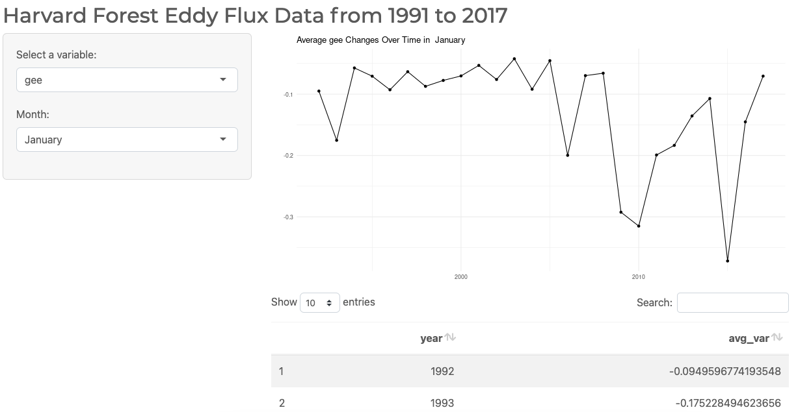

```{r setup, include=FALSE}
knitr::opts_chunk$set(echo = FALSE)
```

I created my first [Shiny App](https://miarothberg.shinyapps.io/assignment_04_10142021_shiny/) to help me with work for two classes: Advanced Data Science and Big Data in Ecology. The data used is from an eddy flux tower in Harvard Forest, a major field site in the world of ecology. It has data on Net Ecoystem Exchange (NEE), Gross Ecosystem Exchange (GEE), respiration, radiation, and temperature at 27 m high (among many others) with measurements taken every 15 minutes starting in 1991.

This app showcases my use of user interaction, variable selection, and bootstrap themeing, and is available at [https://miarothberg.shinyapps.io/assignment_04_10142021_shiny/](https://miarothberg.shinyapps.io/assignment_04_10142021_shiny/). When the page loads, the app looks like this: 



