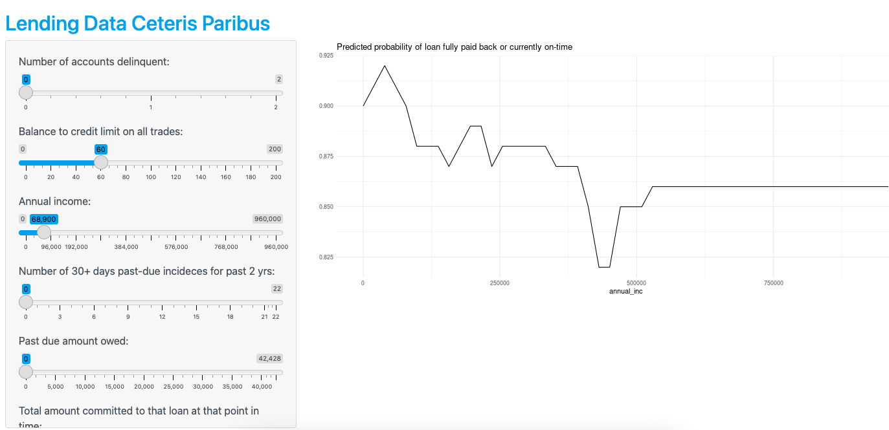

```{r setup, include=FALSE}
knitr::opts_chunk$set(echo = FALSE)
```

For [this app](https://miarothberg.shinyapps.io/assignment_05_shiny/), I used the `lending_club` data available in the `modeldata` library, which is part of `tidymodels` to create a ceteris paribus profile for a predictive random forest model I built in Assignment 3. The app allows users to modify all of the predictive variables in the dataset to determine the model's prediction of the probability that the loan has been paid back fully or is currently on time. Much of the code was borrowed from my professor, Lisa Lendway, but I built some of the input panel and did the theming for the app.

The app is available here: <https://miarothberg.shinyapps.io/assignment_05_shiny/>. The graph will look something like this: 



The code for this graph is available on my Github here: <https://github.com/miarothberg/assignment_05_shiny>. 